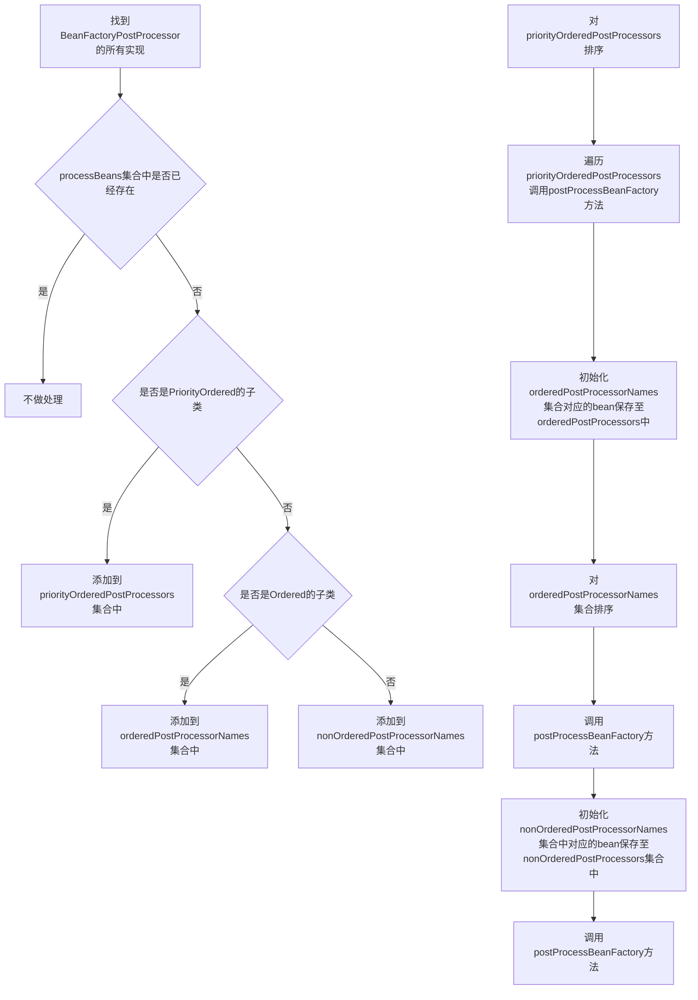

# IOC思想

```
优点：
	松耦合
	灵活性
	可维护
```


# 创建Bean的方式

## XML方式配置Bean

### 无参构造

### 有参构造

### 静态工厂构造

### 实例工厂构造

## 注解方式配置bean介绍

### @Component声明

### 配置类中使用@Bean

### 实现FactoryBean

### 实现BeanDefinitionRegistryPostProcessor

### 实现ImportBeanDefinitionRegistrar

# Refresh方法解析

## 方法简介

### bean配置读取加载入口

### spring框架启动流程

## 方法步骤

### prepareRefresh

#### 容器状态设置

```
		// 设置开始启动时间
		this.startupDate = System.currentTimeMillis();
		// 标记context是否已经被关闭
		this.closed.set(false);
		// 标记context是否已经是active状态
		this.active.set(true);
```

#### 初始化属性设置

```
initPropertySources()
初始化servlet相关的属性
```

#### 检查必备属性是否存在

```
getEnvironment().validateRequiredProperties()
```

### obtainFreshBeanFactory

#### 设置beanFactory序列化id

```
this.beanFactory.setSerializationId(getId());
```

#### 获取beanFactory

```
getBeanFactory()
```

### prepareBeanFactory

#### 设置beanFactory一些属性

```
beanFactory.setBeanClassLoader(getClassLoader());
beanFactory.setBeanExpressionResolver(new StandardBeanExpressionResolver(beanFactory.getBeanClassLoader()));
```

#### 添加后置处理器

```
beanFactory.addBeanPostProcessor()
```

#### 设置忽略的自动装配接口

```
beanFactory.ignoreDependencyInterface(EnvironmentAware.class);
```

#### 注册一些组件

```
beanFactory.registerResolvableDependency
```

### postProcessBeanFactory

```
子类重写以在BeanFactory完成创建后做进一步设置
```

### invokeBeanFactoryPostProcessors

#### 调用BeanDefinitionRegistryPostProcessor实现向容器内添加bean的定义

#### 调用BeanFactoryPostProcessor实现向容器内bean的定义的添加属性

#### 步骤

#### 步骤一

```flow
st=>start: 遍历beanFactoryPostProcessors
cond1=>condition: 实现了BeanDefinitionRegistoryPostProcessor?
o1=>inputoutput: 调用postProcessBeanDefinitionRegistry方法
o2=>inputoutput: 添加至registryProcessors集合中
o3=>inputoutput: 添加至regularPostProcessors
st->cond1
cond1(no)->o3
cond1(yes)->o1->o2
```

#### 步骤二

```flow
st=>start: 遍历beanFactory中BeanDefinitionRegistryPostProcessor实现
cond1=>condition: 实现了PriorityOrdered接口
o1=>inputoutput: 添加至currentRegistryProcessors集合中
o2=>inputoutput: 添加至processedBeans集合中
o3=>inputoutput: 对集合currentRegistryProcessors进行排序
o4=>inputoutput: 将上述结果添加至registryProcessors集合中
o5=>inputoutput: currentRegistryProcessors集合内对象依次调用postProcessBeanDefinitionRegistry方法
o6=>inputoutput: 清空集合currentRegistryProcessors
e=>end
st->cond1
cond1(yes)->o1->o2->o3->o4->o5->o6
cond1(no)->o3->o4->o5
```

#### 步骤三

```flow
st=>start: 遍历beanFactory中BeanDefinitionRegistryPostProcessor实现
cond1=>condition: 若未处理过且实现了Ordered接口
o1=>inputoutput: 添加至currentRegistryProcessors集合中
o2=>inputoutput: 添加至processBeans集合中
o3=>inputoutput: 对集合current RegistryProcessors进行排序
o4=>inputoutput: 将上述结果添加至registryProcessors集合中
o5=>inputoutput: currentRegistryProcessors集合内对象依次调用postProcessBeanDefinitionRegistry方法
o6=>inputoutput: 清空集合currentRegistryProccessors
e=>end
st->cond1
cond1(yes)->o1->o2->o3->o4->o5->o6->e
cond1(no)->o3->o4->o5->o6->e
```

#### 步骤四

```flow
st=>start: 循环遍历步骤3直至beanFactory中不存在未处理的BeanDefinitionRegistryPostProcessor实现
o1=>inputoutput: registryProcessor集合内对象依次调用
o2=>inputoutput: regularPostProcessors集合内对象依次调用postProcessBeanFactory方法
e=>end
st->o1->o2
```

步骤五

```flow
st=>start: 找到BeanFactoryPostProcessor的所有实现
cond1=>condition: processBeans集合中是否已经有此类
cond2=>condition: 是否是PriorityOrdered的实现
cond3=>condition: 是否是Ordered的实现
o=>inputoutput: 不做处理
o1=>inputoutput: 添加到priorityOrderedPostProcessors集合中
o2=>inputoutput: 添加到orderedPostProcessorNames集合中
o3=>inputoutput: 添加到nonOrderedPostProcessorNames集合中
o4=>inputoutput: 对priorityOrderedPostProcessors、orderedPostProcessorNames和nonOrderedPostProcessorNames集合排序调用调用postProcessBeanFactory方法
st->cond1
cond1(yes)->o
cond1(no)->cond2
cond2(yes)->o1->o4
cond2(no)->cond3
cond3(yes)->o2->o4
cond3(no)->o3->o4
```



### registerBeanPostProcessors

#### 找到BeanPostProcessor的实现

#### 排序后注册进容器内

### initMessageSource

#### 初始化国际化相关属性

### initApplicationEventMulticaster

#### 初始化时间广播器

### onRefresh

#### 创建web容器

### registerListeners

#### 添加容器内事件监听器至事件广播器中

#### 派发早期事件

### finishBeanFactoryInitialization

### finishRefresh

#### 初始化生命周期处理器

#### 调用生命周期处理器onRefresh方法

#### 发布ContextRefreshedEvent事件

#### JMX相关处理

### resetCommonCaches